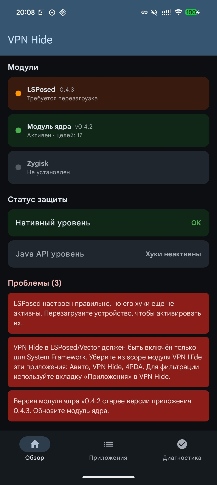
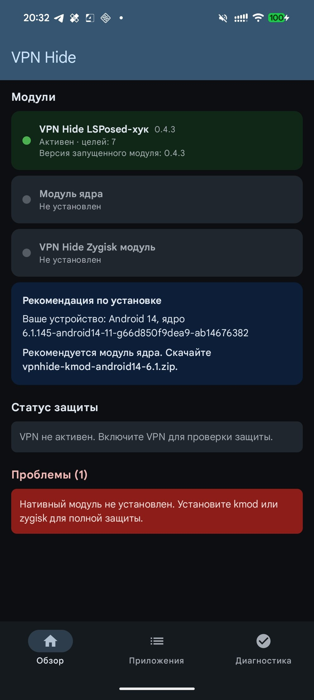
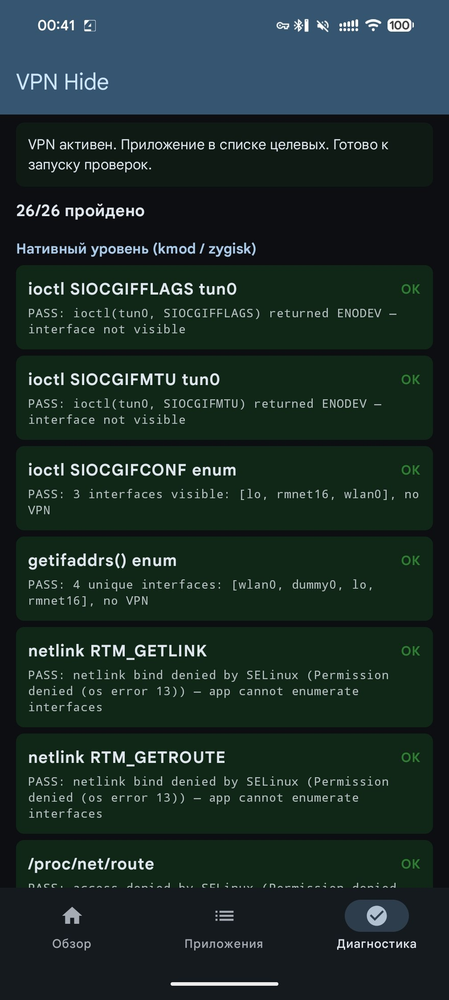

<p align="center">
  
</p>

<h1 align="center">VPN Hide</h1>

<p align="center">Скрывает активное VPN-соединение на Android от выбранных приложений.</p>

<p align="center">
  <a href="https://github.com/okhsunrog/vpnhide/actions/workflows/ci.yml"></a>
  <a href="https://github.com/okhsunrog/vpnhide/releases/latest"></a>
  <a href="https://github.com/okhsunrog/vpnhide/releases"></a>
  <a href="LICENSE"></a>
</p>

<p align="center"><strong><a href="README.en.md">English version</a></strong></p>

## Чем vpnhide лучше аналогов?

Существующие модули, такие как [NoVPNDetect](https://bitbucket.org/yuri-project/novpndetect) и [NoVPNDetect Enhanced](https://github.com/BlueCat300/NoVPNDetectEnhanced), покрывают только **Java API** обнаружение и хукают **внутри процесса** целевого приложения через Xposed. У этого подхода две критические проблемы:

1. **Обнаружение anti-tamper защитой** — любое приложение с проверкой инъекций в память обнаруживает хуки Xposed и отказывается работать. Автор NoVPNDetect Enhanced прямо пишет: *«Модуль не будет работать если у подключаемого приложения есть защита от LSPosed, проверка на инъекции в память. Например MirPay, Т-Банк.»*
2. **Нет нативного покрытия** — приложения, использующие C/C++ код, кроссплатформенные фреймворки (Flutter, React Native) или прямые системные вызовы, могут обнаружить VPN через `ioctl`, `getifaddrs`, netlink-сокеты и `/proc/net/*`. Java-хуки эти векторы полностью пропускают.

vpnhide решает обе проблемы многослойной архитектурой:

**Уровень 1 — Java API (модуль lsposed):** хукает `system_server`, а не целевое приложение. `NetworkCapabilities`, `NetworkInfo` и `LinkProperties` фильтруются на уровне Binder *до того*, как данные попадут в процесс приложения. Приложение получает чистые данные через IPC — никаких инъекций в его процесс, нечего обнаруживать.

**Уровень 2 — нативный (kmod или zygisk):** покрывает все нативные пути обнаружения:
- **kmod** (рекомендуется) — хуки `kretprobe` на уровне ядра. Фильтрует `ioctl` (SIOCGIFFLAGS, SIOCGIFNAME, SIOCGIFCONF), `getifaddrs`/netlink-дампы (RTM_GETLINK, RTM_GETADDR) и чтение `/proc/net/route` — всё до возврата системного вызова в пользовательское пространство. Остальные файлы `/proc/net/*` (`tcp*`, `udp*`, `dev`, `if_inet6` и т.д.) на Android 10+ заблокированы SELinux для untrusted-приложений, так что отдельный хук не нужен. Нулевой след в процессе. Никаких инъекций библиотек. Нечего обнаруживать.
- **zygisk** (альтернатива) — inline-хуки `libc.so` внутри процесса приложения. То же нативное покрытие, что и kmod, но работает в процессе, поэтому теоретически обнаружим продвинутой anti-tamper защитой. Используйте, если ваше ядро не поддерживается kmod.

**Уровень 3 — дополнительные механизмы в самом приложении VPN Hide:**
- **Скрытие интерфейса** — скрывает VPN-интерфейсы, маршруты и VPN-состояние Java API от выбранных приложений
- **Скрытие портов** — блокирует выбранным приложениям доступ к `127.0.0.1` / `::1`, чтобы они не могли проверять локально запущенные VPN / proxy-демоны
- **Скрытие приложений** — скрывает выбранные приложения от выбранных приложений-наблюдателей на уровне PackageManager

Процесс целевого приложения полностью нетронут (при использовании kmod + lsposed) — ни Xposed, ни inline-хуков, ни модифицированных регионов памяти. Благодаря этому vpnhide работает с банковскими и государственными приложениями, которые активно обнаруживают и блокируют модули на основе Xposed.

## Что именно скрывает vpnhide

vpnhide — это не один переключатель, а три разных типа защиты, которые можно включать по отдельности для каждого приложения:

1. **Скрытие интерфейса** — основной слой скрытия VPN. Убирает VPN-интерфейсы и маршруты из нативных API (`ioctl`, `getifaddrs`, `/proc/net/*`, `NetworkInterface`) и из Java API (`NetworkCapabilities`, `NetworkInfo`, `LinkProperties`).
2. **Скрытие портов** — блокирует доступ к localhost для выбранных приложений, чтобы они не могли обнаружить Clash, sing-box, V2Ray, Happ и подобные инструменты через проверку локальных портов.
3. **Скрытие приложений** — позволяет скрыть выбранные установленные приложения от выбранных приложений-наблюдателей. Полезно против проверок package visibility, например когда приложение пытается определить, установлен ли на устройстве VPN или proxy-клиент.

## Какие модули нужны?

Всегда нужно **приложение VPN Hide** (`vpnhide.apk`) плюс один нативный модуль для скрытия интерфейса. Дополнительно приложение может использовать необязательный Ports-модуль для блокировки localhost-портов:

- **`kmod`** (рекомендуется) — полностью out-of-process, невидим для anti-tamper. Требуется поддерживаемое GKI-ядро.
- **`zygisk`** — используйте, если ваше ядро не поддерживается kmod.
- **`portshide`** (необязательно) — установите, если хотите блокировать выбранным приложениям доступ к localhost-портам.

См. [Установка](#установка) для пошаговой инструкции.

## Установка

Скачайте последний релиз из [Releases](https://github.com/okhsunrog/vpnhide/releases).

### Шаг 1 — Приложение VPN Hide + LSPosed

1. Установите `vpnhide.apk` как обычное приложение
2. В менеджере LSPosed включите модуль VPN Hide и добавьте **«System Framework»** в его область действия
3. Перезагрузите устройство (обязательно — хуки LSPosed внедряются в `system_server` при загрузке, поэтому модуль должен быть активен до запуска `system_server`)
4. Откройте приложение VPN Hide и предоставьте ему root-доступ (Magisk запросит автоматически; на KernelSU-Next выдайте разрешение вручную в менеджере)

### Шаг 2 — Нативный модуль для скрытия интерфейса

Откройте приложение VPN Hide. На вкладке **«Обзор»** приложение определит ваше устройство и ядро и покажет, какой именно нативный модуль нужно установить:

- Если ядро поддерживается — будет рекомендован конкретный файл kmod (например, `vpnhide-kmod-android14-6.1.zip`)
- Если нет — будет рекомендован модуль zygisk (`vpnhide-zygisk.zip`)

Установите рекомендованный модуль:
- **kmod:** через менеджер KernelSU-Next → Модули → Установить из хранилища
- **zygisk:** через менеджер KernelSU-Next или Magisk → Модули

Перезагрузите устройство после установки нативного модуля.

### Шаг 3 — Необязательно: установка Ports-модуля

Если вам нужна блокировка localhost-портов, установите `vpnhide-ports.zip` через KernelSU-Next или Magisk manager.

Этот модуль независим от kmod / zygisk и нужен только для режима **Ports** в приложении.

### Шаг 4 — Настройка защит

Откройте приложение VPN Hide → вкладка **«Защита»**.

- Режим **Tun**: используйте переключатели **L** / **K** / **Z** для управления уровнями скрытия интерфейса для каждого приложения (LSPosed, модуль ядра, Zygisk), или нажмите на строку, чтобы переключить все уровни сразу
- Режим **Apps**: выберите, какие приложения нужно скрывать и какие приложения должны выступать наблюдателями
- Режим **Ports**: выберите, каким приложениям нужно запретить доступ к localhost-портам

После изменений нажмите «Сохранить».

После изменения списка принудительно остановите и перезапустите затронутые приложения — хуки вступают в силу при следующем запуске.

> **Примечание:** некоторые приложения обнаруживают хуки Zygisk. Для таких приложений оставьте **Z** выключенным и используйте kmod + LSPosed.

<details>
<summary><b>Настройка через командную строку (для продвинутых)</b></summary>

Редактируйте `/data/adb/vpnhide_kmod/targets.txt`, `/data/adb/vpnhide_zygisk/targets.txt` или `/data/adb/vpnhide_lsposed/targets.txt` напрямую (одно имя пакета на строку). Принудительно остановите и перезапустите затронутые приложения для применения изменений.

</details>

<details>
<summary><b>Ручной подбор GKI (если хотите выбрать файл kmod самостоятельно)</b></summary>

1. На телефоне откройте **Настройки → О телефоне** и найдите строку **Версия ядра**. Она выглядит примерно так: `6.1.75-android14-11-g...`
2. Вам нужны две части из этой строки: версия ядра (`6.1`) и поколение android (`android14`). Вместе они образуют ваше поколение GKI: `android14-6.1`
3. Скачайте соответствующий файл из релиза: `vpnhide-kmod-android14-6.1.zip`

Также можно выполнить `adb shell uname -r` через ADB, чтобы увидеть строку версии ядра.

> **Важно:** `android14` в строке ядра — это НЕ версия Android, а поколение ядра. Например, все Pixel с 6 по 9a используют ядро `android14-6.1` вне зависимости от того, стоит ли на них Android 14 или 15.

</details>

## Скриншоты

| Обзор — всё ОК | Обзор — проблемы | Рекомендация установки |
|:-:|:-:|:-:|
|  |  |  |

| Защита — Tun | Скрытие приложений | Скрытие портов |
|:-:|:-:|:-:|
|  |  |  |

| Скрытие приложений — помощь | Скрытие портов — помощь | Диагностика |
|:-:|:-:|:-:|
|  |  |  |

## Проверка

В приложении есть встроенная система диагностики, которая автоматически обнаруживает большинство проблем с настройкой.

**Обзор** (запускается при каждом открытии приложения):
- Статус модулей для всех трёх уровней (установлен, активен, версия, количество целей)
- Валидация конфигурации LSPosed — читает базу данных LSPosed и проверяет, что VPN Hide включён, System Framework в scope, и нет лишних приложений в scope (частая ошибка при настройке)
- Обнаружение несоответствия версий — сравнивает версии установленных модулей с версией приложения и подсказывает, что именно нужно обновить
- Рекомендация нативного модуля — определяет ядро устройства и подбирает нужный файл kmod, или рекомендует zygisk, если ядро не поддерживается
- Проверка защиты в реальном времени (при активном VPN) — выполняет 16 нативных и 5 Java API проверок, чтобы убедиться, что VPN действительно скрыт

Все обнаруженные проблемы показываются в виде карточек с конкретными инструкциями по исправлению.

**Диагностика** — детальная разбивка по каждой проверке с индивидуальными результатами PASS/FAIL для всех 26 векторов обнаружения. Полезна для отладки, когда «Обзор» показывает частичную защиту.

## Компоненты

| Директория | Что | Как |
|---|---|---|
| **[kmod/](kmod/)** | Модуль ядра (C) | Хуки `kretprobe` в пространстве ядра. Нулевой след в процессе приложения. ([подробнее](kmod/README.md)) |
| **[lsposed/](lsposed/)** | LSPosed-модуль + приложение (Kotlin + Rust) | Хуки `writeToParcel` в `system_server` для per-UID фильтрации Binder. APK предоставляет обзорную панель (статус модулей, проверка версий, валидация конфигурации LSPosed, рекомендации по установке), режимы защиты для скрытия интерфейса / портов / приложений и диагностику. ([подробнее](lsposed/README.md)) |
| **[portshide/](portshide/)** | Модуль скрытия портов (Shell + iptables) | Блокирует выбранным приложениям доступ к `127.0.0.1` / `::1`, скрывая локально запущенные VPN / proxy-демоны от проверок localhost-портов. ([подробнее](portshide/README.md)) |
| **[zygisk/](zygisk/)** | Zygisk-модуль (Rust) | Inline-хуки `libc.so` в процессе приложения. Альтернатива kmod. ([подробнее](zygisk/README.md)) |

## Покрытие обнаружения

| # | Вектор обнаружения | SELinux | kmod | zygisk | lsposed |
|---|---|---|---|---|---|
| 1 | `ioctl(SIOCGIFFLAGS)` на tun0 | | x | x | |
| 2 | `ioctl(SIOCGIFNAME)` разрешение индекса в имя | | x | x | |
| 3 | `ioctl(SIOCGIFMTU)` фингерпринтинг MTU | | x | x | |
| 4 | `ioctl(SIOCGIFCONF)` перечисление интерфейсов | | x | x | |
| 5 | Все остальные `SIOCGIF*` (INDEX, HWADDR, ADDR и т.д.) | | x | x | |
| 6 | `getifaddrs()` (использует netlink внутри) | | x | x | |
| 7 | netlink `RTM_GETLINK` дамп | блок. | x | x | |
| 8 | netlink `RTM_GETADDR` дамп (IPv4 + IPv6) | блок. | x | | |
| 9 | netlink `RTM_GETROUTE` дамп | блок. | | | |
| 10 | `/proc/net/route` | блок. | x | x | |
| 11 | `/proc/net/ipv6_route` | блок. | | x | |
| 12 | `/proc/net/if_inet6` | блок. | | x | |
| 13 | `/proc/net/tcp`, `tcp6` | блок. | | | |
| 14 | `/proc/net/udp`, `udp6` | блок. | | | |
| 15 | `/proc/net/dev` | блок. | | | |
| 16 | `/proc/net/fib_trie` | блок. | | | |
| 17 | `/sys/class/net/tun0/` | блок. | | | |
| 18 | `NetworkCapabilities` (hasTransport, NOT_VPN, transportInfo) | | | | x |
| 19 | `NetworkInfo` (getType, getTypeName) | | | | x |
| 20 | `ConnectivityManager.getActiveNetwork()` | | | | x |
| 21 | `ConnectivityManager.getAllNetworks()` + VPN-сканирование | | | | x |
| 22 | `LinkProperties` (interfaceName) | | | | x |
| 23 | `LinkProperties` (маршруты через VPN-интерфейсы) | | | | x |
| 24 | `NetworkInterface.getNetworkInterfaces()` | | x | x | |
| 25 | `System.getProperty` (настройки прокси) | | | x | |
| 26 | `/proc/net/route` через Java `FileInputStream` | блок. | x | x | |

**блок.** = SELinux запрещает доступ для обычных приложений (Android 10+). Хуки не нужны.

Строки 1–6, 21 и 24 — единственные векторы, доступные обычным приложениям. Всё остальное либо заблокировано SELinux, либо проходит через Java API (покрывается lsposed).

## Сборка из исходников

- **kmod**: `./kmod/build.py --kmi android14-6.1` (или `--all`) — авто-запускает DDK-контейнер через podman/docker. Подробнее: [kmod/BUILDING.md](kmod/BUILDING.md).
- **zygisk**: `cd zygisk && ./build.py` (Rust + NDK + cargo-ndk)
- **lsposed**: `cd lsposed && ./gradlew assembleDebug` (JDK 17 + Rust + NDK + cargo-ndk)

### Заметки для контрибьюторов, застрявших на Windows

Если вы используете Windows, при сборке некоторых подпроектов возникают определенные неудобства.

**lsposed**: отлично собирается в Android Studio.

**portshide**: `cd .\portshide\; python .\build-zip.py` выполняется без проблем.

Для следующих двух вам (к сожалению) потребуется установить [Docker for Windows](https://docs.docker.com/desktop/setup/install/windows-install/).

**kmod**: `python .\kmod\build.py --kmi android14-6.1` — скрипт сам подберёт docker и поднимет образ `ddk-min` (тот же, что в CI).

**zygisk**:
```powershell
docker run --rm -it -v "${PWD}:/workspace" -v "vpnhide_cargo_cache:/usr/local/cargo/registry" -w /workspace ghcr.io/okhsunrog/vpnhide/ci:latest bash -c 'cd zygisk && python3 ./build.py'
```
Причина, по которой `zygisk` нельзя собрать напрямую, заключается в том, что исходный код зависимости `zygisk-api` содержит файл с именем `aux.rs`. Cargo использует `libgit2` для работы с git, в котором есть защита, запрещающая создавать файлы, _содержащие_ зарезервированные слова Windows. Вы получите ошибку: `cannot checkout to invalid path 'src/aux.rs'; class=Checkout (20)`. [Сообщают](https://superuser.com/a/1929659), что после какого-то обновления стало возможным создавать файлы, содержащие зарезервированные слова, **с** расширением, но, похоже, в `libgit2` это поведение не было изменено.

## Проверено на

- [RKNHardering](https://github.com/xtclovver/RKNHardering/) — все векторы обнаружения чисты
- [YourVPNDead](https://github.com/loop-uh/yourvpndead) — все векторы обнаружения чисты

Оба реализуют официальную методику обнаружения VPN/прокси Минцифры РФ ([источник](https://t.me/ruitunion/893)).

## Раздельное туннелирование (split tunneling)

Корректно работает с конфигурациями VPN с раздельным туннелированием. Затрагиваются только приложения из списка целей.

Настоятельно рекомендуется использовать split tunneling в паре с VPN Hide.

Приложения-детекторы, сравнивающие публичный IP устройства с внешними чекерами, лучше оставлять вне туннеля — их трафик должен выходить через оператора, а не через VPN.

## Модель угроз

vpnhide скрывает активный VPN от конкретных приложений. Он НЕ предназначен для:
- Скрытия root или кастомной прошивки
- Обхода Play Integrity
- Обмана серверной детекции (утечки DNS, чёрные списки IP, фингерпринтинг латентности/TLS)

## Известные ограничения

- `kmod` требует GKI-ядро с `CONFIG_KPROBES=y` (стандарт на устройствах Android 12+)
- `lsposed` требует LSPosed, LSPosed-Next или Vector
- `zygisk` — только arm64
- Прямые системные вызовы `svc #0` обходят хуки libc в zygisk — для этого и нужен kmod
- Серверная детекция неисправима на стороне клиента — используйте раздельное туннелирование

## Лицензия

MIT. См. [LICENSE](LICENSE).

Модуль ядра объявляет `MODULE_LICENSE("GPL")`, как требуется ядром Linux для разрешения символов `EXPORT_SYMBOL_GPL` во время выполнения.

## Star History

[](https://star-history.com/#okhsunrog/vpnhide&Date)
